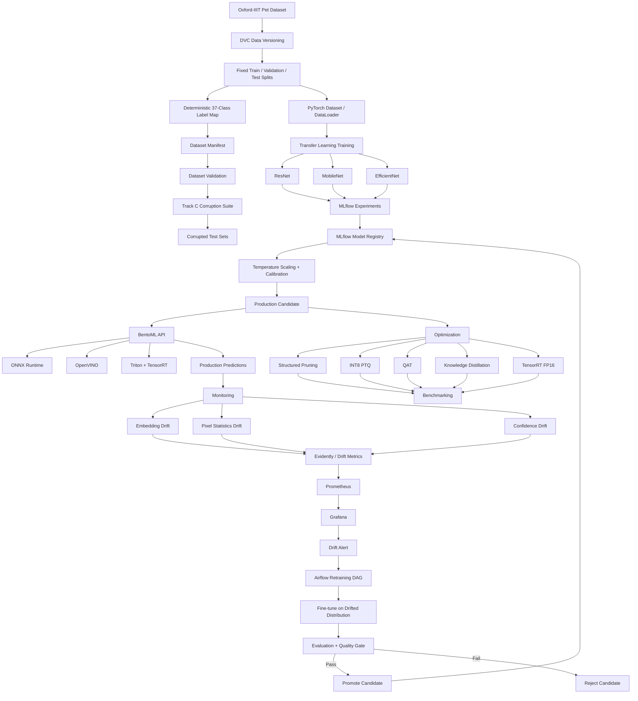

# Track C — Pet Breed Classification MLOps Architecture

## 1. Project Overview

This project implements an end-to-end MLOps platform for pet breed classification using the Oxford-IIIT Pet dataset.

The system accepts a pet image and produces:

- Top-3 breed predictions
- Calibrated confidence
- Abstention decision
- Predicted species (cat/dog)
- Model version

The architecture covers the complete lifecycle from reproducible data preparation and model training to optimized serving, monitoring, drift-triggered retraining, and model promotion.

## 2. High-Level Architecture



## 3. Architecture Layers

### 3.1 Data Layer

The data layer is responsible for downloading, versioning, validating, splitting, and transforming the Oxford-IIIT Pet dataset.

Main components:

- Oxford-IIIT Pet dataset
- DVC
- Fixed train/validation/test splits
- Deterministic 37-class label mapping
- Dataset manifest
- Image integrity validation
- Corruption generation

The test set is protected from training and validation workflows.

### 3.2 Reproducibility Layer

DVC versions the dataset and generated data artifacts.

The intended data flow is:

```
Raw Dataset
    ↓
Frozen Splits
    ↓
Deterministic Label Map
    ↓
Manifest
    ↓
Validation
    ↓
Corruption Suite
```

All generated artifacts must be reproducible from a clean environment.

## 4. Dataset Manifest

The manifest is the central metadata artifact connecting data preparation, training, evaluation, and monitoring.

Required fields:

```
image_id
path
breed
species
class_index
split
corruption
severity
width
height
```

The manifest records both clean images and generated corruption variants.

## 5. Dataset Validation

Before training, the following checks must pass:

- Every manifest path exists.
- Every image can be opened.
- Train, validation, and test splits do not overlap.
- Exactly 37 labels are present.
- The label mapping is deterministic.
- Every training class contains at least 50 images.
- No image is smaller than 32x32 pixels.
- Images are consistently converted to RGB.
- Corruption metadata links generated images to their source images.
- Frozen split assignments are preserved.

Validation failures should identify the affected artifact and provide an actionable error.

## 6. Corruption Suite

The corruption suite provides controlled robustness and drift evaluation.

Required corruptions:

1. Gaussian blur
2. Brightness decrease
3. Brightness increase
4. JPEG compression at quality 30
5. Downscale then upscale to 96x96
6. Motion blur

Each corruption has three deterministic severity levels.

The original test images must never be mutated. Generated corrupted images are separate artifacts linked to their original image IDs and recorded in the manifest.

## 7. Training Layer

Training uses PyTorch transfer learning.

At least three backbones are evaluated:

- ResNet
- MobileNet
- EfficientNet

Training flow:

```
Dataset
    ↓
PyTorch Dataset / DataLoader
    ↓
Transfer Learning
    ↓
Model Training
    ↓
Validation
    ↓
MLflow Run
    ↓
Model Registry
```

At least five MLflow runs must be recorded as part of the final project.

## 8. Experiment Tracking and Registry

MLflow tracks the experiments and model artifacts.

A run should record, where applicable:

- Model architecture
- Hyperparameters
- Training configuration
- Dataset/version information
- Evaluation metrics
- Calibration metrics
- Model artifacts
- Runtime information
- Model version

The selected production candidate is registered in the MLflow Model Registry based on measured evaluation results.

## 9. Calibration and Abstention

Calibration is mandatory for the production model.

Temperature scaling is used to calibrate model probabilities.

Inference flow:

```
Input Image
    ↓
Shared Preprocessing
    ↓
Model
    ↓
Temperature Scaling
    ↓
Calibrated Probabilities
    ↓
Abstention Decision
    ↓
Top-3 Predictions
```

Required evaluation artifacts include:

- Reliability diagram
- Calibrated confidence
- Coverage
- Selective accuracy

The API response must expose the top-3 predictions, calibrated confidence, abstention decision, species, and model version.

Example response shape:

```json
{
  "predictions": [
    {
      "breed": "...",
      "confidence": 0.00
    }
  ],
  "species": "cat",
  "abstained": false,
  "model_version": "..."
}
```

## 10. Training and Inference Consistency

Training and serving must use the same preprocessing contract.

This includes:

- Image loading
- RGB conversion
- Resize
- Normalization
- Tensor conversion
- Deterministic label mapping

A dedicated consistency test must verify that training and inference preprocessing produce matching logits within an absolute tolerance of:

```
1e-4
```

This test is intended to prevent training/serving skew.

## 11. Serving Layer

BentoML provides the application-facing inference API.

Serving flow:

```
Client
    ↓
BentoML API
    ↓
Input Validation
    ↓
Shared Preprocessing
    ↓
Production Model / Runtime
    ↓
Calibration + Abstention
    ↓
Top-3 Response
```

The API is the stable boundary between clients and the underlying model/runtime.

## 12. Inference Runtimes

The project evaluates CPU and GPU inference paths.

### CPU

ONNX Runtime:

```
PyTorch Model
    ↓
ONNX Export
    ↓
ONNX Runtime
```

OpenVINO:

```
PyTorch Model
    ↓
ONNX / OpenVINO Representation
    ↓
OpenVINO Runtime
```

### GPU

TensorRT and Triton:

```
PyTorch Model
    ↓
TensorRT Engine
    ↓
Triton Inference Server
```

The hardware and runtime used for each benchmark must be recorded.

## 13. Model Optimization

The optimization stage compares the baseline model with:

- Structured pruning
- INT8 post-training quantization (PTQ)
- Quantization-aware training (QAT)
- Knowledge distillation
- TensorRT FP16

Conceptually:

```
Baseline
   ├── Structured Pruning
   ├── INT8 PTQ
   ├── QAT
   ├── Knowledge Distillation
   └── TensorRT FP16
```

Each variant must be evaluated rather than assuming that an optimization improves every metric.

## 14. Benchmarking

Benchmark results must compare the baseline and optimized variants using measured values.

Required measurements:

- Top-1 accuracy
- p95 latency
- Model size
- Hardware
- Runtime

If an optimization causes a regression, the regression must be reported and explained. No performance numbers should be fabricated or inferred without measurement.

## 15. Production Monitoring

Production predictions are monitored for changes in the input and prediction distributions.

Required monitoring areas:

### Embedding Drift

Use MMD and/or a domain classifier to detect changes in the embedding distribution.

### Pixel Statistics Drift

Track changes in image-level statistics between reference and production data.

### Confidence Drift

Track changes in prediction confidence distributions.

Monitoring flow:

```
Production Requests
    ↓
Prediction / Feature Logs
    ↓
Drift Metrics
    ↓
Evidently
    ↓
Prometheus
    ↓
Grafana
    ↓
Alert
```

## 16. Prometheus and Grafana

Prometheus collects operational and model-monitoring metrics.

Grafana provides dashboards for, at minimum:

- Request/prediction traffic
- Latency
- Confidence
- Drift
- Errors
- Model/runtime health

Alerting thresholds must be based on configured project metrics and recorded in the project documentation.

## 17. Automated Retraining

Airflow orchestrates drift-triggered retraining.

Retraining flow:

```
Drift Detected
    ↓
Airflow DAG
    ↓
Prepare Drifted / Corrupted Distribution
    ↓
Fine-tune Model
    ↓
Evaluate Candidate
    ↓
Production Quality Gate
    ↓
┌───────────────┐
│               │
PASS           FAIL
│               │
↓               ↓
Promote       Reject
```

The final README must demonstrate the retraining workflow and its resulting quality-gate decision.

## 18. Retraining Quality Gate

A candidate model is compared against the current production model.

The required promotion condition is:

```
New Top-1 Accuracy >= Production Top-1 Accuracy - 0.01
```

If the condition passes, the candidate can be promoted.

If it fails, the candidate is rejected and the existing production model remains in place.

The evaluation and decision must be stored as an inspectable artifact.

## 19. CI/CD

GitHub Actions provides automated project quality checks.

The CI pipeline is expected to cover:

```
Pull Request
    ↓
Install Dependencies
    ↓
Lint
    ↓
Format Check
    ↓
Type Check
    ↓
Unit Tests
    ↓
Pipeline / Data Tests
    ↓
Quality Checks
```

CI jobs must return meaningful exit codes so that failures prevent invalid changes from progressing.

## 20. Load Testing

Locust is used to evaluate the serving endpoint under concurrent request load.

Load-testing results should record:

- Request volume
- Response latency
- p95 latency
- Error rate
- Test configuration
- Hardware/runtime configuration

The benchmark must distinguish load-test results from single-request inference benchmarks.

## 21. Canary Deployment

The serving architecture supports a canary model path for evaluating a candidate before full promotion.

Conceptually:

```
Production Traffic
       ↓
   ┌───┴────┐
   ↓        ↓
Stable   Canary
Model    Model
   ↓        ↓
   └───┬────┘
       ↓
Compare Metrics
       ↓
Quality Gate
       ↓
Promote / Reject
```

Canary evaluation must use measured production-like metrics before changing the production model.

## 22. Artifact Lifecycle

The complete artifact lifecycle is:

```
Dataset
    ↓
DVC Version
    ↓
Fixed Splits + Label Map
    ↓
Manifest + Validation
    ↓
Corruption Test Sets
    ↓
Training
    ↓
MLflow Experiments
    ↓
Model Registry
    ↓
Calibration
    ↓
Optimization
    ↓
Benchmarking
    ↓
BentoML / ONNX / OpenVINO / TensorRT / Triton
    ↓
Production
    ↓
Monitoring
    ↓
Drift Detection
    ↓
Airflow Retraining
    ↓
Quality Gate
    ↓
Promotion / Rejection
```

## 23. Repository Structure

The planned repository structure is:

```
pet-breed-mlops/
│
├── .github/
│   └── workflows/
│
├── configs/
├── data/
├── docker/
│
├── docs/
│   └── architecture.md
│
├── models/
├── reports/
├── scripts/
├── src/
├── tests/
│
├── .gitignore
├── dvc.yaml
├── pyproject.toml
└── README.md
```

Directory responsibilities:

- `src/` — application and ML pipeline source code
- `tests/` — automated tests
- `scripts/` — reproducible pipeline and utility scripts
- `configs/` — configuration
- `data/` — DVC-managed data artifacts
- `models/` — model artifacts or model references
- `reports/` — evaluation, calibration, benchmark, and monitoring reports
- `docs/` — project documentation
- `docker/` — containerization assets
- `.github/workflows/` — CI/CD workflows

## 24. Project Scope

The architecture covers the required Track C workflow:

- Oxford-IIIT Pet dataset
- DVC data versioning
- Frozen train/validation/test splits
- Deterministic 37-class label mapping
- Dataset manifest
- Dataset integrity validation
- Controlled image corruptions
- PyTorch transfer learning
- Three or more model backbones
- MLflow experiment tracking
- MLflow model registry
- Temperature scaling
- Calibration evaluation
- Abstention
- BentoML serving
- ONNX Runtime
- OpenVINO
- TensorRT
- Triton
- Structured pruning
- INT8 PTQ
- QAT
- Knowledge distillation
- TensorRT FP16
- Benchmarking
- Locust load testing
- Embedding drift monitoring
- Pixel-statistics drift monitoring
- Confidence drift monitoring
- Evidently
- Prometheus
- Grafana
- Airflow retraining
- Retraining quality gate
- Model promotion/rejection
- GitHub Actions CI/CD
- Final documentation and evidence

## 25. Non-Goals

This project does not aim to:

- Build a general-purpose image classification platform for arbitrary datasets.
- Train on the protected test set.
- Change frozen split assignments during experimentation.
- Hide negative evaluation or benchmark results.
- Replace measured results with theoretical performance claims.
- Fabricate metrics or deployment measurements.

The project should prioritize reproducibility and honest reporting of measured results.

## 26. Hardware Assumptions

The architecture supports both CPU and GPU inference.

CPU-oriented evaluation:

- ONNX Runtime
- OpenVINO

GPU-oriented evaluation:

- TensorRT
- Triton

Every reported latency or throughput result must identify the hardware and runtime configuration used.

## 27. Security and Reliability Boundaries

The serving layer should validate incoming image requests before inference.

The system should also ensure:

- Model versions are explicit.
- Dataset versions are traceable.
- Production and candidate models are distinguishable.
- Test data remains protected.
- Retraining cannot silently replace the production model.
- Promotion occurs only after the required quality gate.
- Monitoring failures are observable.
- Pipeline artifacts are reproducible.

## 28. Definition of Done

The Track C architecture is complete when the end-to-end system can demonstrate:

```
Dataset
  ↓
Versioned + Reproducible
  ↓
Validated
  ↓
Fixed Splits
  ↓
Corruption Evaluation
  ↓
Multiple Backbones
  ↓
MLflow Tracking
  ↓
Model Registry
  ↓
Calibration + Abstention
  ↓
Optimization
  ↓
Benchmarking
  ↓
BentoML Serving
  ↓
ONNX / OpenVINO / TensorRT / Triton
  ↓
Monitoring
  ↓
Drift Detection
  ↓
Airflow Retraining
  ↓
Quality Gate
  ↓
Promotion / Rejection
```

The final repository must also provide:

- Reproducible setup instructions
- Session changelog
- Architecture documentation
- Evaluation reports
- Benchmark results
- Calibration results
- Monitoring/drift evidence
- Retraining demonstration
- CI/CD configuration
- Final README documentation
- Evidence of peer-review participation

## 29. Engineering Principle

The project prioritizes reproducibility, measurable engineering decisions, and production readiness.

Every major stage should produce an inspectable artifact, metric, test, or report.

Negative results are acceptable when they are actually measured and documented. The architecture therefore treats reproducibility and honest reporting as first-class project requirements.
